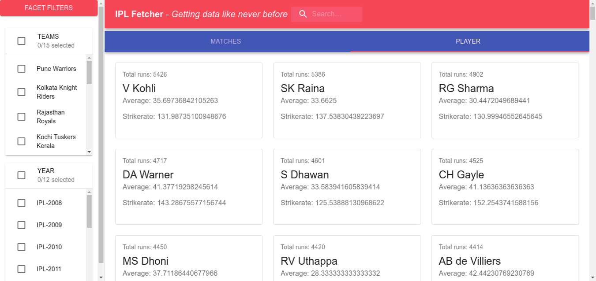
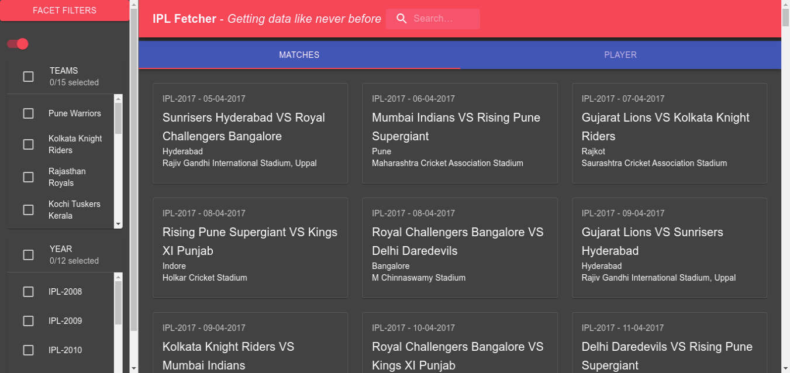

# IPL-fetcher - Search the IPL

## Introduction
Discovery page for IPL where users can search & use facet filters to find different
entities – players, teams, owners & venus. Users should be able to filter based on any attributes related to the entity. It as easy, intuitive and as less steps as possible for the user to reach a particular entity.

***

## Look and Feel

</img>
***
</img>

***

## Getting Started
* Fork and Clone the repo
  `git clone https://github.com/abhishek2x/IPL-fetcher.git`
* Change the directory
  `cd IPL-fetcher`
* Install node dependencies
  `npm i` or `npm install` or `yarn`
* Start the Server
  `npm start`

***

## Technology Stack
* React Js
* Material UI
* GitHub Pages
* Netlify
* React Context API for State Management

***

## Optimisations Implemented
* Code Splitting
* Using Lazy Loading (React.lazy and Suspense)

## Loading Time - Calculated using Chrome Dev Tools
* Finish: 1.24 s
* DOMContentLoaded: 2.34 s
* Load: 4.19 s

## Possible Optimisations in the Current Application
* Long list Loading using `react-window` 
* Using React.PureComponent

*The React ecosystem is vast and powerful. We can leverage the numerous tools that are available to us to build huge complex applications. Above are just a few techniques that can make our applications fast and smooth. The additional effort is definitely worth the benefits of getting a higher-performance, more maintainable codebase.*

***

## Website Link 
Website is currently hosted on GitHub pages
Link 1: <a href="https://abhishek2x.github.io/IPL-fetcher/">https://abhishek2x.github.io/IPL-fetcher/<a/>

***

### Sample data you can use:
https://www.kaggle.com/ramjidoolla/ipl-data-set

This project was bootstrapped with [Create React App](https://github.com/facebook/create-react-app).

***

